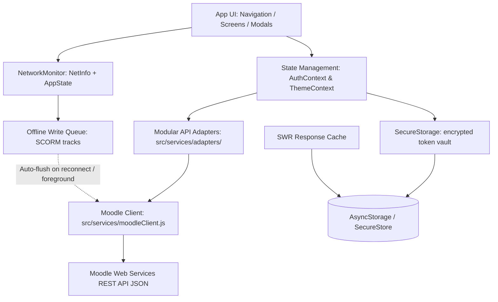

# 📱 UNIlearn Maharashtra — Native Mobile LMS

<div align="center">

[](https://reactnative.dev)
[](https://expo.dev)
[](https://react.dev)
[](https://moodle.org)
[](mobile/__tests__)
[](https://github.com/shashankh3/moodle-lms-android)

<br/>

**A high-performance, native mobile Learning Management System (LMS) built with React Native for the Maharashtra State e-learning initiative.**  
Powered by the **Moodle Web Services REST API**, designed with an **offline-first** architecture, secured with **encrypted token storage**, and engineered for deep accessibility and trilingual vernacular learning.

[Features](#-key-features) • [Architecture](#️-architecture) • [Screens & Modules](#-screens--modules) • [Tech Stack](#️-technology-stack) • [Getting Started](#-getting-started) • [Testing](#-testing) • [Security](#-security--token-handling)

</div>

---

## 📖 Table of Contents

- [Project Overview](#-project-overview)
- [Key Features](#-key-features)
- [Accessibility & Vernacular Inclusivity](#-accessibility--vernacular-inclusivity)
- [Architecture](#️-architecture)
- [Screens & Modules](#-screens--modules)
- [Technology Stack](#️-technology-stack)
- [Project Directory Structure](#-project-directory-structure)
- [Moodle REST API Integration](#-moodle-rest-api-integration)
- [Offline-First & SCORM Sync](#-offline-first--scorm-sync)
- [Testing](#-testing)
- [Security & Token Handling](#-security--token-handling)
- [Getting Started](#-getting-started)
  - [Prerequisites](#prerequisites)
  - [Installation](#installation)
  - [Running on Physical Device (Expo Go)](#running-on-physical-device-expo-go)
  - [Production & APK Builds (EAS Build)](#production--apk-builds-eas-build)
- [Configuration & Environment](#️-configuration--environment)
- [Troubleshooting & Gotchas](#-troubleshooting--gotchas)

---

## 🌟 Project Overview

**UNIlearn Maharashtra** is the mobile application gateway for the **Maharashtra State Government's UNIlearn e-learning ecosystem** (`mh.unilearn.org.in`). It bridges the digital divide for thousands of government learners across Maharashtra — including Anganwadi workers, Early Childhood Care and Education (ECCE) educators, ASHA health workers, school teachers, and state trainees.

Built with **React Native + Expo**, the app delivers a **true native mobile experience** — fluid gestures, responsive layouts, native SCORM module rendering, offline synchronization, and multi-lingual typography — with no reliance on clunky third-party web wrappers.

---

## 🚀 Key Features

### 📱 Native In-App Learning Journeys
- **No forced browser redirects**: Core learning workflows (course content, quizzes, lesson navigation, certificate downloads) take place directly inside native screens, with a secure in-app auth session for optional SSO.
- **Micro-Animations & Smooth Feedback**: Integrated with `expo-haptics`, `lucide-react-native`, and `@shopify/flash-list` for buttery 60 FPS scrolling even on budget Android devices.

### 🌐 Trilingual Vernacular Support
- Native multi-language localization powered by `i18next` and `react-i18next`.
- Instant, zero-reload switching between **English**, **मराठी (Marathi)**, and **हिंदी (Hindi)**.
- Tailored Devanagari typography using curated Google fonts: **Mukta**, **Baloo 2**, and **Kalam**.

### ♿ Groundbreaking Inclusive Accessibility
- **Global Dyslexia Font System**: Dynamic full-tree typography patching supporting **OpenDyslexic** (Regular, Bold, Italic).
- **High-Contrast & Dual-Tone Theming**: Full dark mode and high-contrast accessibility themes to assist visually impaired learners.
- **Floating Accessibility Toolbar**: Instant access to font size scaling, line height tuning, dyslexia toggling, and reading rulers across any active screen.

### ⚡ Offline-First Architecture
- **Local Progress Caching**: Courses, module metadata, and syllabus trees are cached with a stale-while-revalidate strategy (`@react-native-async-storage/async-storage`) and re-render instantly without network.
- **SCORM Progress Queuing**: SCORM 1.2 / 2004 tracking data (`cmi.core.lesson_status`, `cmi.core.score.raw`, `cmi.suspend_data`) commits locally when offline.
- **Automatic Sync-on-Reconnect**: Monitored via `@react-native-community/netinfo`; queued sync packets auto-flush to Moodle upon reconnecting to 4G/Wi-Fi.
- **Foreground Sync**: The offline queue also flushes the moment the app returns to the foreground (`AppState` listener).

### 🎓 Comprehensive Learning Suite
- **Interactive SCORM & Lesson Players**: Native WebView sandboxing with auto-injected SCORM JavaScript API bridges (`window.API` for SCORM 1.2, `window.API_1484_11` for SCORM 2004).
- **Native Quiz Engine**: Full attempt engine handling **Multiple Choice, True/False, Short Answer, Essay, and Matching** questions, with timer and attempt review.
- **Assignment Submissions**: Multi-file attachment uploads directly to Moodle draft file areas via multipart REST endpoints.
- **Digital Certificates & Badges**: Open Badges viewing and one-tap PDF certificate generation, viewing, and WhatsApp/email sharing via `expo-print` and `expo-sharing`.
- **Gradebook & Analytics**: Interactive performance trends and course completion visual charts with `react-native-chart-kit` and `react-native-svg`.
- **Push Notifications**: Device registration with Moodle's AirNotifier service (`core_user_add_user_device`) using native FCM tokens, with a safe no-op path inside Expo Go.

---

## ♿ Accessibility & Vernacular Inclusivity

Accessibility is a first-class citizen in this application:

| Feature | Description | Implementation |
|:---|:---|:---|
| **Dyslexia Mode** | Converts application typography to weighted OpenDyslexic | `src/utils/dyslexiaPatcher.js` intercepts native Text renders |
| **Devanagari Vernacular** | Native rendering for Marathi & Hindi scripts | Font assets loaded via `expo-font` (`Mukta`, `Baloo2`, `Kalam`) |
| **Font Scaling** | Fluid font resizing from 85% to 145% without layout breakage | `AccessibilityToolbar.js` + dynamic layout scaling tokens |
| **High Contrast** | High-contrast accessibility mode inspired by WCAG contrast guidelines | Tailored color matrix in `ThemeContext.js` |
| **Haptic Confirmations**| Physical feedback on quiz answers, downloads, and buttons | Integrated via `expo-haptics` |

---

## 🏗️ Architecture

The app follows a clean, decoupled layer architecture:



### Modular API Adapter Design
The API layer is split into domain-focused adapter modules located under `src/services/adapters/`, composed into a single `MobileAPI` facade by `apiAdapter.js`:
- **`authMethods.js`**: Credential validation, token autologin, user profile resolution.
- **`courseMethods.js`**: Enrolled courses, course contents, completion statuses, module detail fetching.
- **`quizMethods.js`**: Quiz metadata, attempts management, question retrieval, question submission.
- **`assignMethods.js`**: Assignment list, submission status, grade review, file upload.
- **`gradesMethods.js`**: Table breakdowns, grade items, feedback summaries.
- **`badgesMethods.js`**: User badges, badge criteria, issuer data.
- **`filesMethods.js`**: Private user file management and uploads.
- **`forumMethods.js`**: Discussions, replies, and posting.
- **`calendarMethods.js`**: Action events and deadline tracking.
- **`scormMethods.js`**: SCORM package loading and tracking sync.
- **`coreMethods.js`**: Authenticated URL resolution (autologin keys with rate-limit fallback), connection testing.
- **`lessonMethods.js`**, **`messagesMethods.js`**: Lesson player data and direct messaging.

---

## 📱 Screens & Modules

```
src/screens/
├── analytics/          # Course progress and performance radar charts
├── assignments/        # Assignment overview, file submitter, grader notes
├── auth/               # LoginScreen.js (credential login, token validation, SSO auth session)
├── badges/             # State-issued badge wallet and achievements
├── calendar/           # Monthly agenda, due dates, test deadlines
├── certificates/       # PDF certificate renderer, print & share engine
├── courses/            # Course directory, section viewer, SCORM player, Lesson player
├── dashboard/          # Home dashboard, enrolled courses carousel, quick metrics
├── files/              # Moodle private files explorer & uploader
├── forums/             # Community discussion boards and teacher Q&A
├── grades/             # Detailed gradebook and course scorecards
├── messages/           # Learner-instructor instant direct messaging
├── more/               # Official links, state helpline, account settings
├── quizzes/            # Native question player, timer, attempt review
└── settings/           # Theme toggle, language selector, accessibility tools
```

---

## 🛠️ Technology Stack

| Domain | Technology | Version | Purpose |
|:---|:---|:---|:---|
| **Core Framework** | React Native | `0.86.3` | Mobile foundation |
| **SDK Platform** | Expo | `^57.0.22` | Development toolchain & native runtime |
| **Language Runtime** | React | `19.2.3` | Modern React with Concurrent features |
| **Navigation** | React Navigation | `v7` | Native Stack + Animated Bottom Tabs |
| **List Performance** | @shopify/flash-list | `^2.0.2` | High-performance recycling list views |
| **Encrypted Storage** | expo-secure-store | `^57.0.4` | Token & credential vault (Android Keystore) |
| **Local Storage** | AsyncStorage | `^2.1.0` | Offline cache & non-sensitive persistence |
| **Network & Connectivity** | NetInfo | `^12.0.1` | Network state detection & offline syncing |
| **Vector Graphics & Icons** | Lucide React Native | `^0.475.0` | Modern feather icon suite |
| **Charts & Graphs** | react-native-chart-kit | `^7.0.2` | Dashboard progress analytics |
| **PDF & Sharing** | expo-print & expo-sharing | `~57.0.x` | Certificate generation & export |
| **Web Container** | react-native-webview | `^13.16.1` | Sandboxed SCORM 1.2 / 2004 engine |
| **Internationalization** | i18next & react-i18next | `^26.4.0` / `^17.0.12` | Trilingual translation engine |
| **Testing** | Jest + jest-expo | `^30.5.1` / `~57.0.5` | Unit test harness (60 tests) |

---

## 📂 Project Directory Structure

```bash
moodle-lms-android/
├── README.md                      # Root Project Documentation (You are here)
├── package.json                   # Root script orchestrator
└── mobile/                        # Expo & React Native Project Root
    ├── App.js                     # Root entry point, font loading, foreground sync
    ├── app.json                   # Expo application configuration & metadata
    ├── eas.json                   # EAS Build profiles (development, preview, production)
    ├── package.json               # Mobile application dependencies & Jest config
    ├── __tests__/                 # Unit tests (SCORM, storage, quiz parser, API client)
    ├── assets/                    # Static brand logos, icons, and custom fonts
    │   └── fonts/                 # OpenDyslexic, Mukta, Baloo2, Kalam font assets
    └── src/
        ├── components/            # Reusable UI widgets, Drawers, Toolbars, Logos
        ├── context/               # Global AuthContext and ThemeContext providers
        ├── i18n/                  # Translation dictionaries (en.json, hi.json, mr.json)
        ├── navigation/            # RootNavigator, TabNavigator, Navigation references
        ├── screens/               # 15 domain screen suites
        ├── services/              # Core API client, Network monitor, Adapters
        │   ├── moodleClient.js    # Raw Moodle REST HTTP fetch engine + auth-error hook
        │   ├── apiAdapter.js      # MobileAPI facade composing the domain adapters
        │   ├── NetworkMonitor.js  # NetInfo observer & SCORM sync queue flusher
        │   ├── PushNotificationService.js # Safe push registration service
        │   ├── storage/           # SecureStorage — encrypted token vault + migration
        │   ├── scorm/             # SCORM 1.2 data model & offline track queue
        │   └── adapters/          # Domain-specific API adapter modules
        └── utils/                 # Dyslexia patcher, date formatters, HTML cleaners
```

---

## 🔌 Moodle REST API Integration

The application interfaces directly with Moodle's built-in Web Services (`/webservice/rest/server.php`). It requires the `moodle_mobile_app` service (or a custom service with equivalent capabilities) enabled on the server.

### Key Web Service Functions Utilized:
- **Authentication & Session**: `tool_mobile_get_site_info`, `tool_mobile_get_autologin_key`
- **User & Profile**: `core_user_get_users_by_field`, `core_user_add_user_device` (push registration)
- **Courses**: `core_enrol_get_users_courses`, `core_course_get_contents`
- **SCORM**: `mod_scorm_get_scorms_by_courses`, `mod_scorm_get_scorm_scoes`, `mod_scorm_insert_tracks`
- **Quizzes**: `mod_quiz_get_quizzes_by_courses`, `mod_quiz_start_attempt`, `mod_quiz_process_attempt`
- **Assignments**: `mod_assign_get_assignments`, `mod_assign_get_submission_status`
- **Grades**: `gradereport_user_get_grade_items`
- **Badges**: `core_badges_get_user_badges`
- **Calendar**: `core_calendar_get_action_events_by_timesort`
- **Forums**: `mod_forum_get_forum_discussions`
- **Messages**: `core_message_get_conversations`, `core_message_send_instant_messages`

---

## ⚡ Offline-First & SCORM Sync

1. **SCORM Interceptor Bridge**: When a user launches a SCORM module inside `ScormPlayerScreen`, an embedded JavaScript bridge interceptor binds to the window:
   ```javascript
   window.API_1484_11 = { ... }; // SCORM 2004
   window.API = { ... };         // SCORM 1.2
   ```
2. **Local Commit**: When `LMSCommit("")` or `Commit("")` is triggered by the SCORM package, progress is written to local storage.
3. **Queue Manager**: If the device loses internet access, `NetworkMonitor` buffers the payload into an offline sync queue.
4. **Auto-Flush**: When `@react-native-community/netinfo` signals that internet connectivity is restored — **or the app returns to the foreground** — the queue flushes commits back to Moodle's `mod_scorm_insert_tracks` endpoint in the background.

---

## 🧪 Testing

The project ships with a unit test suite (no device or emulator required):

```bash
cd mobile
npm test
```

| Suite | Coverage |
|:---|:---|
| `ScormDataModel12.test.js` | CMI data model, seeding, track collection, commit/finish lifecycle, offline fallback |
| `ScormOfflineQueue.test.js` | Queueing, filtering, sync success/transient/fatal paths |
| `SecureStorage.test.js` | Encrypted routing, plaintext exclusion, legacy migration |
| `moodleQuizParser.test.js` | Question type detection (MC/TF/short answer/essay), HTML entity decoding |
| `moodleClient.test.js` | URL normalization, client configuration |
| `moodleClientAuthErrors.test.js` | Token-expiry detection and auto-logout hook |

---

## 🔐 Security & Token Handling

- **Encrypted token vault**: Moodle session tokens, user profiles, and autologin keys are stored in `expo-secure-store` (backed by the Android Keystore) via a dedicated `SecureStorage` layer — never in plaintext. A one-time, automatic migration moves any legacy plaintext values on first launch.
- **Expo Go compatibility**: Inside Expo Go, the vault transparently falls back to AsyncStorage so the app works out of the box without a custom build.
- **Session expiry handling**: When Moodle reports an invalid or expired token, the app automatically logs the user out and returns to the login screen instead of surfacing raw errors.
- **Credential safety**: Login requests are POST-only (no credentials in URLs); tokens are masked in request diagnostics logs.
- **Transport security**: Cleartext HTTP traffic is disabled by default via `network_security_config.xml`, with an explicit allowlist mechanism for staging servers.

---

## 🏁 Getting Started

### Prerequisites
- **Node.js**: `v18.x` or `v20.x` (LTS recommended)
- **npm** or **yarn**
- **Expo Go App**: Installed on your physical Android device (download from Google Play Store)
- **Git**

### Installation

1. **Clone the repository:**
   ```bash
   git clone https://github.com/shashankh3/moodle-lms-android.git
   cd moodle-lms-android
   ```

2. **Navigate into the mobile directory and install dependencies:**
   ```bash
   cd mobile
   npm install
   ```

---

### Running on Physical Device (Expo Go)

1. **Start the Metro development server with clear cache:**
   ```bash
   npx expo start -c
   ```

2. **Launch on your device:**
   - Open the **Expo Go** app on your Android device.
   - Scan the QR code displayed in your terminal.
   - *Note: Ensure your physical device and computer are on the same Wi-Fi network (or use `npx expo start --tunnel`).*

---

### Production & APK Builds (EAS Build)

To build standalone installable APK binaries or production app bundles without Expo Go:

1. **Install EAS CLI globally:**
   ```bash
   npm install -g eas-cli
   ```

2. **Log in to your Expo account:**
   ```bash
   eas login
   ```

3. **Build an Android APK (Preview/Internal Distribution):**
   ```bash
   eas build --platform android --profile preview
   ```

4. **Build a Development Client APK:**
   ```bash
   eas build --platform android --profile development
   ```

---

## ⚙️ Configuration & Environment

- **Target Moodle Server**: Defaults to `https://mh.unilearn.org.in`. Users can also connect to any custom Moodle 3.9+ / 4.x instance that has Mobile Web Services enabled.
- **Android Cleartext Traffic**: Configured in `mobile/android/app/src/main/res/xml/network_security_config.xml` — HTTPS-only by default, with an allowlist for optional cleartext overrides on custom enterprise LMS staging servers.

---

## 💡 Troubleshooting & Gotchas

> [!TIP]
> **Expo SDK 57 & Expo Go Compatibility**:
> In Expo SDK 53+, remote push notifications (`expo-notifications`) were deprecated from the standard Expo Go Android client. The app contains a native safeguard in [PushNotificationService.js](mobile/src/services/PushNotificationService.js) that checks `isRunningInExpoGo()` to prevent red screen crashes while running inside Expo Go, while automatically activating native tokens in standalone production APKs.

> [!NOTE]
> **Secure Storage**:
> Auth tokens, user profiles, and autologin keys are stored in `expo-secure-store` (encrypted via the Android Keystore). Inside the free Expo Go app, the same `SecureStorage` layer transparently falls back to AsyncStorage, so the app remains 100% functional without a custom build. All legacy plaintext values are migrated automatically on first launch.

---

<div align="center">
  <sub>Built with ❤️ for learners, educators, and trainers across Maharashtra State.</sub>
</div>
